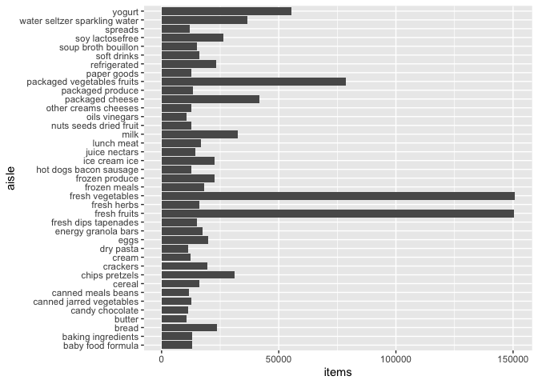

p8105_hw3_hz3023
================
Huiyi Zhu
2025-10-12

## Prepare

``` r
library(ggridges)
library(tidyverse)
```

    ## ── Attaching core tidyverse packages ──────────────────────── tidyverse 2.0.0 ──
    ## ✔ dplyr     1.1.4     ✔ readr     2.1.5
    ## ✔ forcats   1.0.1     ✔ stringr   1.5.2
    ## ✔ ggplot2   4.0.0     ✔ tibble    3.3.0
    ## ✔ lubridate 1.9.4     ✔ tidyr     1.3.1
    ## ✔ purrr     1.1.0     
    ## ── Conflicts ────────────────────────────────────────── tidyverse_conflicts() ──
    ## ✖ dplyr::filter() masks stats::filter()
    ## ✖ dplyr::lag()    masks stats::lag()
    ## ℹ Use the conflicted package (<http://conflicted.r-lib.org/>) to force all conflicts to become errors

## Problem 1

``` r
library(p8105.datasets)
data("instacart")
view("instacart") 
```

In this dataset, there are 1384617 observations and 15 variables. Key
variable include the order id, product id, reordered times, user id and
order number and others.

``` r
instacart |>
  group_by(aisle) |>
  summarize(
    items = n()) |>
  mutate(
    aisle_ranking = min_rank(items)) |> 
  arrange(aisle_ranking)
```

    ## # A tibble: 134 × 3
    ##    aisle                      items aisle_ranking
    ##    <chr>                      <int>         <int>
    ##  1 beauty                       287             1
    ##  2 frozen juice                 294             2
    ##  3 baby accessories             306             3
    ##  4 baby bath body care          328             4
    ##  5 kitchen supplies             448             5
    ##  6 specialty wines champagnes   461             6
    ##  7 ice cream toppings           504             7
    ##  8 shave needs                  532             8
    ##  9 skin care                    534             9
    ## 10 first aid                    539            10
    ## # ℹ 124 more rows

There are 143 aisles in the data set. The most items ordered from fresh
vegetables aisles.

Below is a bar polt show the number orderd in each aisle.

``` r
instacart |>
  group_by(aisle) |>
  summarize(items = n()) |>
  filter(items > 10000) |>
ggplot(aes(x = aisle, y = items)) +
  geom_col()+
    coord_flip()
```

<!-- -->

``` r
ggsave("p8105_hw1p1_barpolt.pdf")
```

    ## Saving 7 x 5 in image

``` r
instacart |>
  filter(aisle %in% c("baking ingredients", "dog food care", "packaged vegetables fruits")) |>
  group_by(aisle, product_name) |>
  summarize(orders = n()) |> 
  arrange(aisle, desc(orders)) |>
  group_by(aisle) |>
  slice_head(n = 3) |>
  knitr::kable()
```

    ## `summarise()` has grouped output by 'aisle'. You can override using the
    ## `.groups` argument.

| aisle | product_name | orders |
|:---|:---|---:|
| baking ingredients | Light Brown Sugar | 499 |
| baking ingredients | Pure Baking Soda | 387 |
| baking ingredients | Cane Sugar | 336 |
| dog food care | Snack Sticks Chicken & Rice Recipe Dog Treats | 30 |
| dog food care | Organix Chicken & Brown Rice Recipe | 28 |
| dog food care | Small Dog Biscuits | 26 |
| packaged vegetables fruits | Organic Baby Spinach | 9784 |
| packaged vegetables fruits | Organic Raspberries | 5546 |
| packaged vegetables fruits | Organic Blueberries | 4966 |

``` r
instacart |>
  filter(product_name %in% c("Pink Lady Apples", "Coffee Ice Cream")) |>
  group_by(product_name, order_dow) |>
  summarize(mean_hour = mean(order_hour_of_day)) |>
  pivot_wider(
    names_from = order_dow,
    values_from = mean_hour) |>
  knitr::kable(digits = 1)
```

    ## `summarise()` has grouped output by 'product_name'. You can override using the
    ## `.groups` argument.

| product_name     |    0 |    1 |    2 |    3 |    4 |    5 |    6 |
|:-----------------|-----:|-----:|-----:|-----:|-----:|-----:|-----:|
| Coffee Ice Cream | 13.8 | 14.3 | 15.4 | 15.3 | 15.2 | 12.3 | 13.8 |
| Pink Lady Apples | 13.4 | 11.4 | 11.7 | 14.2 | 11.6 | 12.8 | 11.9 |

## Problem 2

``` r
nyc_zillow_df = 
  read_csv("./zillow_data/Zip_zori_uc_sfrcondomfr_sm_month_NYC.csv") |> 
  pivot_longer(
    -(RegionID:CountyName),
    names_to = "month",
    values_to = "price") |> 
  janitor::clean_names() |> 
  rename(zip_code = region_name) |> 
  mutate(
    month = as_date(month),
    year = floor_date(month, unit = "year"),
    zip_code = as.numeric(zip_code)) |> 
  select(-county_name)
```

    ## Rows: 149 Columns: 125
    ## ── Column specification ────────────────────────────────────────────────────────
    ## Delimiter: ","
    ## chr   (6): RegionType, StateName, State, City, Metro, CountyName
    ## dbl (119): RegionID, SizeRank, RegionName, 2015-01-31, 2015-02-28, 2015-03-3...
    ## 
    ## ℹ Use `spec()` to retrieve the full column specification for this data.
    ## ℹ Specify the column types or set `show_col_types = FALSE` to quiet this message.

``` r
zip_codes_df = 
  read_csv("./zillow_data/Zip Codes.csv") |> 
  janitor::clean_names() |> 
  filter(
    !(zip_code == 10463 & county == "New York"),
    !(zip_code == 11201 & county == "New York"))  |> 
  mutate(
    borough = case_match(
      county,
      "Bronx" ~ "Bronx",
      "Kings" ~ "Brooklyn",
      "New York" ~ "Manhattan",
      "Queens" ~ "Queens",
      "Richmond" ~ "Staten Island"
    )
  ) |> 
  select(zip_code, borough, neighborhood)
```

    ## Rows: 322 Columns: 7
    ## ── Column specification ────────────────────────────────────────────────────────
    ## Delimiter: ","
    ## chr (4): County, County Code, File Date, Neighborhood
    ## dbl (3): State FIPS, County FIPS, ZipCode
    ## 
    ## ℹ Use `spec()` to retrieve the full column specification for this data.
    ## ℹ Specify the column types or set `show_col_types = FALSE` to quiet this message.

``` r
nyc_price_df = 
  left_join(nyc_zillow_df, zip_codes_df, by = "zip_code")
```

``` r
Q2=
  nyc_price_df |> 
  filter(month >= as.Date("2015-01-01"), month <= as.Date("2024-08-31")) |> 
  group_by(zip_code) |> 
  summarize(n_months = sum(!is.na(price))) |> 
  summarize(
    all = sum(n_months == 116),
    less10 = sum(n_months < 10)
  )
```

There are 48 codes are observed in all 116 months.There are 26 codes are
observed fewer than 10 times.

``` r
nyc_price_df |>
  group_by(borough, year) |>
  summarize(avg_rental_price = mean(price, na.rm = TRUE)) |>
  pivot_wider(
    names_from = year,
    values_from = avg_rental_price
  ) |>
  arrange(borough) |>
  knitr::kable()
```

    ## `summarise()` has grouped output by 'borough'. You can override using the
    ## `.groups` argument.

| borough | 2015-01-01 | 2016-01-01 | 2017-01-01 | 2018-01-01 | 2019-01-01 | 2020-01-01 | 2021-01-01 | 2022-01-01 | 2023-01-01 | 2024-01-01 |
|:---|---:|---:|---:|---:|---:|---:|---:|---:|---:|---:|
| Bronx | 1759.595 | 1520.194 | 1543.599 | 1639.430 | 1705.589 | 1811.443 | 1857.777 | 2054.267 | 2285.459 | 2496.896 |
| Brooklyn | 2492.928 | 2520.357 | 2545.828 | 2547.291 | 2630.504 | 2555.051 | 2549.890 | 2868.199 | 3015.184 | 3125.657 |
| Manhattan | 3022.042 | 3038.818 | 3133.848 | 3183.703 | 3310.408 | 3106.517 | 3136.632 | 3778.375 | 3932.610 | 4078.440 |
| Queens | 2214.707 | 2271.955 | 2263.303 | 2291.918 | 2387.816 | 2315.632 | 2210.787 | 2406.038 | 2561.615 | 2693.584 |
| Staten Island | NaN | NaN | NaN | NaN | NaN | 1977.608 | 2045.430 | 2147.436 | 2332.934 | 2536.442 |

According to the table, the average rental price in each borough
increase every year.

``` r
smooth=
nyc_price_df |>
  ggplot(aes(x = year, y = price, color = borough)) +
  geom_smooth()+
   labs(
    title = "NYC Rental Prices (2015–2024)",
    x = "Year",
    y = "Average Rental Price",
    caption = "Data from zillow",
    color = "Borough"
  ) +
  theme(legend.position="bottom")
```

The polt shows that there is a increase trend in rental prices in all
boroughs from 2015 to 2024 in NYC. Manhattan have the hightest price and
Bronx have the lowest price over the year.

``` r
violin=
nyc_price_df |>
  filter(year == "2023-01-01") |>
  group_by(borough, zip_code) |>
  summarize(mean_price = mean(price, na.rm = TRUE)) |>
  ggplot(aes(x = borough, y = mean_price)) +
  geom_violin(aes(fill = borough), alpha=.5) +
  stat_summary(fun="mean",color="blue")
```

    ## `summarise()` has grouped output by 'borough'. You can override using the
    ## `.groups` argument.

``` r
  labs(
    title = "Average Rental Price within ZIP Code in 2023",
    x = "Borough",
    y = "Average Rental Price"
  ) +
 theme(legend.position="bottom")
```

    ## NULL

Like the last polt, Manhattan have the highest average rents in NYC,
however, it also have the widest range.Staten Island have the narrowest
range in NYC.

``` r
library(patchwork)
smooth/violin+
  labs(
    title = "Average Rental Price within ZIP Code in 2023",
    x = "Borough",
    y = "Average Rental Price"
  )
```

    ## `geom_smooth()` using method = 'gam' and formula = 'y ~ s(x, bs = "cs")'

    ## Warning: Removed 6834 rows containing non-finite outside the scale range
    ## (`stat_smooth()`).

    ## Warning: Failed to fit group 5.
    ## Caused by error in `smooth.construct.cr.smooth.spec()`:
    ## ! x has insufficient unique values to support 10 knots: reduce k.

    ## Warning: Removed 24 rows containing non-finite outside the scale range
    ## (`stat_ydensity()`).

    ## Warning: Removed 24 rows containing non-finite outside the scale range
    ## (`stat_summary()`).

    ## Warning: Removed 5 rows containing missing values or values outside the scale range
    ## (`geom_segment()`).

<!-- -->

``` r
ggsave("p8105_hw1p2_Combine.pdf")
```

    ## Saving 7 x 5 in image
    ## `geom_smooth()` using method = 'gam' and formula = 'y ~ s(x, bs = "cs")'

    ## Warning: Removed 6834 rows containing non-finite outside the scale range
    ## (`stat_smooth()`).

    ## Warning: Failed to fit group 5.
    ## Caused by error in `smooth.construct.cr.smooth.spec()`:
    ## ! x has insufficient unique values to support 10 knots: reduce k.

    ## Warning: Removed 24 rows containing non-finite outside the scale range
    ## (`stat_ydensity()`).

    ## Warning: Removed 24 rows containing non-finite outside the scale range
    ## (`stat_summary()`).

    ## Warning: Removed 5 rows containing missing values or values outside the scale range
    ## (`geom_segment()`).

    ## Warning in grid.Call.graphics(C_text, as.graphicsAnnot(x$label), x$x, x$y, :
    ## for 'NYC Rental Prices (2015–2024)' in 'mbcsToSbcs': - substituted for –
    ## (U+2013)

\##Problem 3
